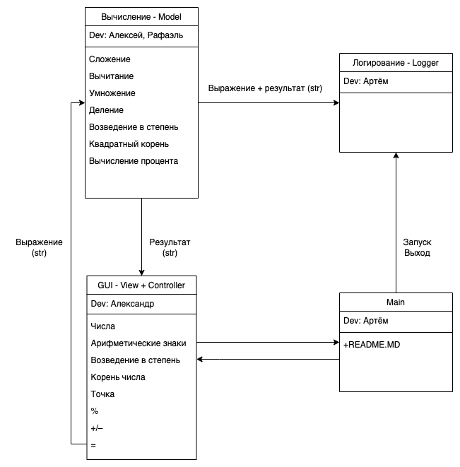

# Группа №3
## Архитектура проекта

Разработчики модулей программы:
* GUI - Александр
* Model - Алексей и Рафаэль
* Логирование - Артем
* Main - Артем
 
#### calc_expression(expression) -> str
на вход получает строку, которую надо вычислить
возвращает итог типа str
например: '((1+2)+3)*2*2/(3+9)+(12+13)'
print(calc_expression('((1+2)+3)*2*2/(3+9)+(12+13)')) -> возвращает 27.0
