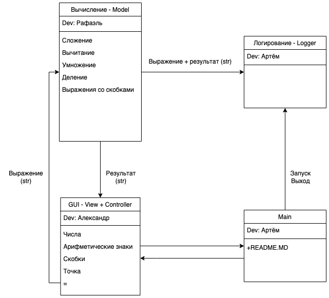
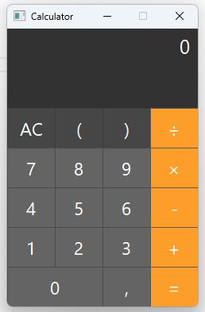
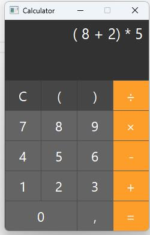
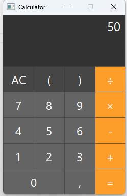

# Группа №3
## Архитектура проекта

Разработчики модулей программы:
* GUI - Александр
* Model - Рафаэль
* Логирование - Артем
* Main - Артем
 
### **calc_expression(expression) -> str**
на вход получает строку, которую надо вычислить
возвращает итог типа str
например:  
_print(calc_expression('((1+2)+3)*2*2/(3+9)+(12.5+13.5)'))_  
_и_  
_print(calc_expression('((1+2)+3)*2*2/(3+9)+(12,5+13,5)'))_  
_возвращают 28_

### **log**
Модуль log принимает данные от модулей calc и main и на основе этих данных создает запись о выполняемых программой 
действиях в файле с расширением csv.  
Формат записи: *дата; время; операция; пользователь;*  
если выполнялись вычисления, то добавляются следующие записи: *условие; результат*

### **gui**
Модуль gui представляет собой графический интерфейс взаимодействия с пользователем. Пользователь вводит посредством 
клавиатуры или панели программы данные для вычисления, эти данные отображаются в поле дисплея и 
передаются в модуль calc для дальнейшей обработки, от модуля calc получает результат вычисления и выводит обратно на 
дисплей.

### **main**
Модуль main является точкой входа. С его помощью происходит запуск остальных модулей программы.

### **Пример использования программы**
Запуск программы:

Задание условия для вычисления:

Решение:

